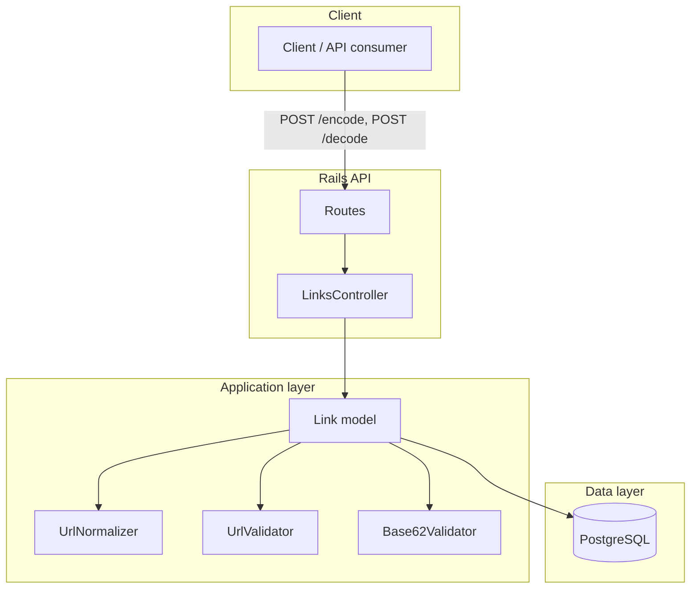
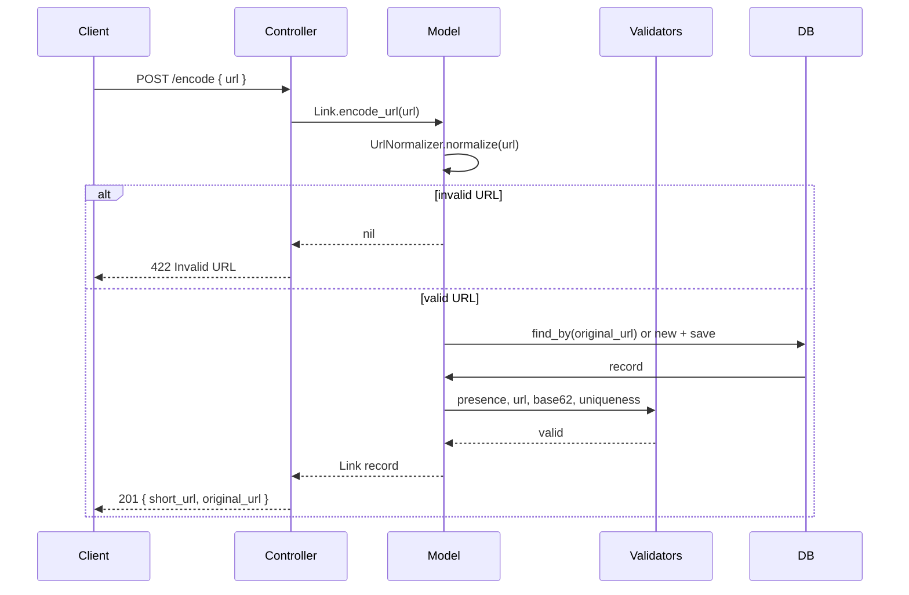
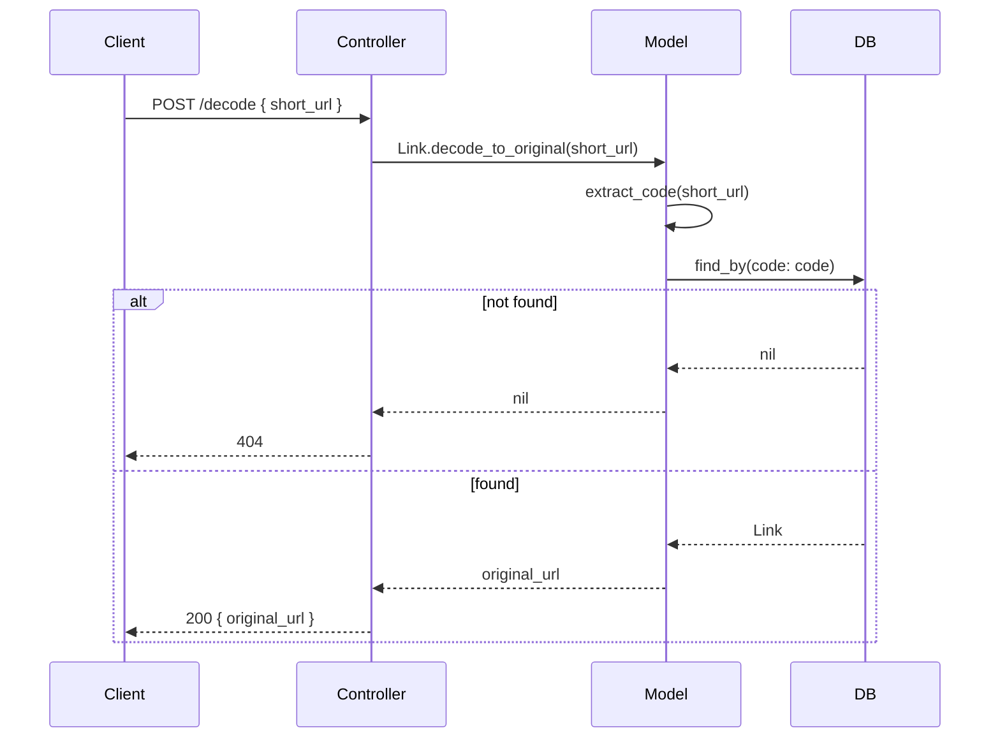
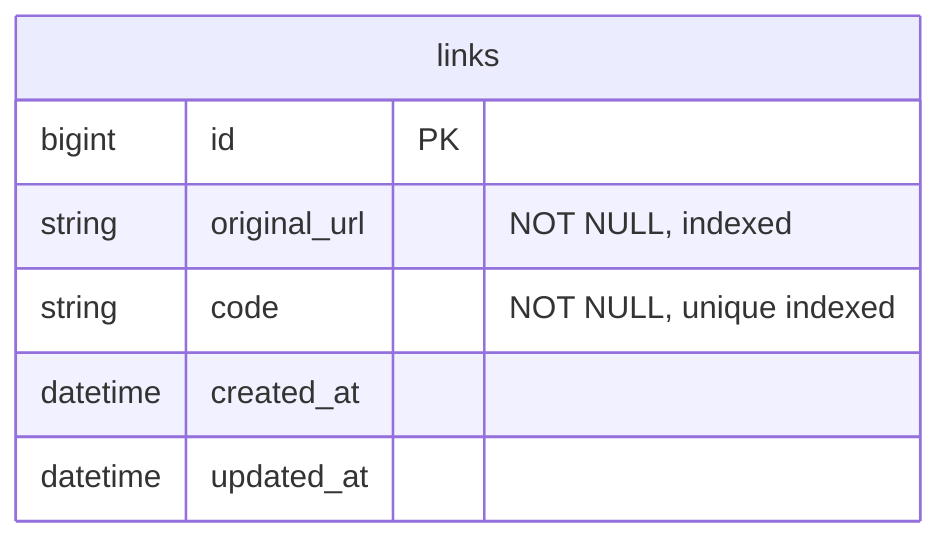

# Routly — Architecture

## High-level overview



## Request flow

### Encode (URL → short URL)



### Decode (short URL → original URL)



## Component map

| Layer | Component | Responsibility |
|-------|-----------|----------------|
| **HTTP** | Routes | POST /encode, POST /decode → LinksController |
| **Controller** | LinksController | Params, call model, JSON response, error handling |
| **Model** | Link | encode_url, decode_to_original, normalize_url, DB |
| **Validators** | UrlValidator | original_url must be valid (HTTP/HTTPS, no js/data) |
| **Validators** | Base62Validator | code: base62 only, length 6 |
| **Lib** | UrlNormalizer | Normalize and validate URL format |
| **Data** | PostgreSQL | links (original_url, code) |

## Data model



## File layout

```
Routly/
├── app/
│   ├── controllers/
│   │   ├── application_controller.rb
│   │   └── links_controller.rb
│   ├── models/
│   │   └── link.rb
│   └── validators/
│       ├── url_validator.rb
│       └── base62_validator.rb
├── config/
│   ├── routes.rb
│   └── database.yml
├── lib/
│   └── url_normalizer.rb
├── db/
│   └── migrate/
│       └── 001_create_links.rb
└── docs/
    └── ARCHITECTURE.md
```
